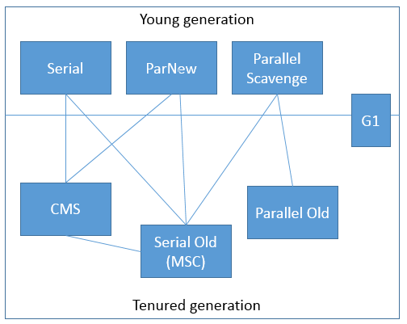
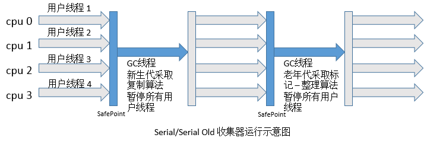

# 1. 前言  
* 垃圾收集主要是针对**堆和方法区**进行。  
* 程序计数器、虚拟机栈和本地方法栈这三个区域属于线程私有的，只存在于线程的生命周期内，线程结束之后也会消失，因此不需要对这三个区域进行垃圾回收。
# 2. JVM分代垃圾回收策略的基础概念
## 2.1. 为什么要分代
分代的垃圾回收策略，是基于这样一个事实：不同的对象的生命周期是不一样的。因此，**不同生命周期的对象可以采取不同的收集方式，以便提高回收效率**。

试想，在不进行对象存活时间区分的情况下，每次垃圾回收都是对整个堆空间进行回收，花费时间相对会长，同时，因为每次回收都需要遍历所有存活对象，但实际上，对于生命周期长的对象而言，这种遍历是没有效果的，因为可能进行了很多次遍历，但是他们依旧存在。因此，**分代垃圾回收采用分治的思想，进行代的划分，把不同生命周期的对象放在不同代上，不同代上采用最适合它的垃圾回收方式进行回收**。

## 2.2. 如何分代
- 方法区中常量引用的对象。
- 本地方法栈中JNI(Native方法)引用的对象。

<div align="center"></div>

虚拟机中的共划分为三个代：**年轻代（Young Generation）、年老代（Old Generation）和持久代（Permanent Generation）**。其中持久代主要存放的是Java类的类信息，与垃圾收集要收集的Java对象关系不大。**年轻代和年老代的划分是对垃圾收集影响比较大的**。

## 2.3. 虚拟机分代

### 2.3.1. 年轻代
所有新生成的对象首先都是放在年轻代的。年轻代的目标就是尽可能快速的收集掉那些生命周期短的对象。

年轻代分三个区。**一个Eden区，两个Survivor区(一般而言)**。大部分对象在Eden区中生成。当Eden区满时，还存活的对象将被复制到Survivor区（两个中的一个），当这个Survivor区满时，此区的存活对象将被复制到另外一个Survivor区，当这个Survivor区也满了的时候，从第一个Survivor区复制过来的并且此时还存活的对象，将被复制“年老区(Tenured)”。

**新生代(年轻代)有划分为Eden、From Survivor和To Survivor三个部分，他们对应的内存空间的大小比例为8:1:1**，也就是，为对象分配内存的时候，首先使用Eden空间，经过GC后，没有被回收的会首先进入From Survivor区域，任何时候，都会保持一个Survivorq区域（From Survivor或To Survivor）完全空闲，也就是说**新生代的内存利用率最大为90%**。From Survivor和To Survivor两个区域会根据GC的实际情况，进行互换，将From Survivor区域中的对象全部复制到To Survivor区域中，或者反过来，将To Survivor区域中的对象全部复制到From Survivor区域中。

### 2.3.2. 年老代
**在年轻代中经历了N次垃圾回收后仍然存活的对象，就会被放到年老代中。因此，可以认为年老代中存放的都是一些生命周期较长的对象**。

GC过程中，当某些对象经过多次GC都没有被回收，可能会进入到年老代。或者，当新生代没有足够的空间来为对象分配内存时，可能会直接在年老代进行分配。

### 2.3.3. 持久代
**用于存放静态文件，如Java类、方法等。持久代对垃圾回收没有显著影响**，但是有些应用可能动态生成或者调用一些class，例如Hibernate等，在这种时候需要设置一个比较大的持久代空间来存放这些运行过程中新增的类。持久代大小通过`-XX:MaxPermSize=<N>`进行设置。

**永久代实际上对应着虚拟机运行时数据区的“方法区”，这里主要存放类信息、静态变量、常量等数据。一般情况下，永久代中对应的对象的GC效率非常低，因为这里的的大部分对象在运行都不要进行GC，它们会一直被利用，直到JVM退出**。

## 2.4. 什么情况下触发垃圾回收
由于对象进行了分代处理，因此垃圾回收区域、时间也不一样。GC有两种类型：**Scavenge GC和Full GC**。

### 2.4.1. Scavenge GC

一般情况下，当新对象生成，并且在Eden申请空间失败时，就会触发Scavenge GC，对Eden区域进行GC，清除非存活对象，并且把尚且存活的对象移动到Survivor区。然后整理Survivor的两个区。这种方式的GC是对年轻代的Eden区进行，不会影响到年老代。因为**大部分对象都是从Eden区开始的，同时Eden区不会分配的很大，所以Eden区的GC会频繁进行**。因而，**一般在这里需要使用速度快、效率高的算法，使Eden去能尽快空闲出来**。

### 2.4.2. Full GC
对整个堆进行整理，包括Young、Tenured和Perm。Full GC因为需要对整个块进行回收，所以比Scavenge GC要慢，因此**应该尽可能减少Full GC的次数。在对JVM调优的过程中，很大一部分工作就是对于FullGC的调节**。有如下原因可能导致Full GC：

- 年老代（Tenured）被写满
- 持久代（Perm）被写满
- System.gc()被显示调用
- 上一次GC之后Heap的各域分配策略动态变化


# 3. 判断一个对象是否可被回收
## 3.1. 引用计数法
给对象中添加一个引用计数器，每当一个地方引用这个对象时，计数器值+1；当引用失效时，计数器值-1。任何时刻计数值为0的对象就是不可能再被使用的。
两个对象出现循环引用的情况下，此时引用计数器永远不为 0，导致无法对它们进行回收。

正因为循环引用的存在，因此 Java 虚拟机不使用引用计数算法。
```java
/**
 * 虚拟机参数：-verbose:gc
 */
public class ReferenceCountingGC
{
    private Object instance = null;
    private static final int _1MB = 1024 * 1024;
    
    /** 这个成员属性唯一的作用就是占用一点内存 */
    private byte[] bigSize = new byte[2 * _1MB];
    
    public static void main(String[] args)
    {
        ReferenceCountingGC objectA = new ReferenceCountingGC();
        ReferenceCountingGC objectB = new ReferenceCountingGC();
        objectA.instance = objectB;
        objectB.instance = objectA;
        objectA = null;
        objectB = null;
        
        System.gc();
    }
}
```
【运行结果】
```
[GC 4417K->288K(61440K), 0.0013498 secs]
[Full GC 288K->194K(61440K), 0.0094790 secs]
```
两个对象相互引用着，但是虚拟机还是把这两个对象回收掉了，这也说明**虚拟机并不是通过引用计数法来判定对象是否存活的**。

## 3.2. 可达性分析法
这个算法的基本思想是**通过一系列称为`GC Roots`的对象作为起始点，从这些节点向下搜索，搜索所走过的路径称为引用链，当一个对象到GC Roots没有任何引用链（即GC Roots到对象不可达）时，则证明此对象是不可用的**。
Java语言中，可以作为GCRoots的对象包括下面几种：
- 虚拟机栈（栈帧中的局部变量区，也叫做局部变量表）中引用的对象。
- 方法区中的类静态属性引用的对象。
- 方法区中常量引用的对象。
- 本地方法栈中JNI(Native方法)引用的对象。

<div align="center"></div>

由图可知，obj8、obj9、obj10都没有到GCRoots对象的引用链，即便obj9和obj10之间有引用链，他们还是会被当成垃圾处理，可以进行回收。

### 3.2.1. 可达性分析算法的两次标记阶段
对于可达性分析算法而言，未到达的对象并非是“非死不可”的，若要宣判一个对象死亡，至少需要经历两次标记阶段。

1. 如果对象在进行可达性分析后发现没有与GCRoots相连的引用链，则该对象被第一次标记并进行一次筛选，筛选条件为**是否有必要执行该对象的finalize()方法**，若对象没有覆盖finalize方法或者该finalize方法已经被虚拟机执行过了，则均视作不必要执行该对象的finalize方法，即该对象将会被回收。反之，若**对象覆盖了finalize方法并且该finalize方法并没有被执行过，那么，这个对象会被放置在一个叫F-Queue的队列中**，之后会由虚拟机自动建立的、优先级低的Finalizer线程去执行，而虚拟机不必要等待该线程执行结束，即虚拟机只负责建立线程，其他的事情交给此线程去处理。

2. 对F-Queue中对象进行第二次标记，如果对象在finalize方法中拯救了自己，即关联上了GCRoots引用链，如把this关键字赋值给其他变量，那么在第二次标记的时候该对象将从“即将回收”的集合中移除，如果对象还是没有拯救自己，那就会被回收。

如下代码演示了一个对象如何在finalize方法中拯救了自己，然而，它只能拯救自己一次，第二次就被回收了。具体代码如下：
```java
package com.betop.jvm.gc;

/*
 * 此代码演示了两点：
 * 1.对象可以再被GC时自我拯救
 * 2.这种自救的机会只有一次，因为一个对象的finalize()方法最多只会被系统自动调用一次
 * */
public class FinalizeEscapeGC {

    public String name;
    public static FinalizeEscapeGC SAVE_HOOK = null;

    public FinalizeEscapeGC(String name) {
        this.name = name;
    }

    public void isAlive() {
        System.out.println("yes, i am still alive :)");
    }

    @Override
    protected void finalize() throws Throwable {
        super.finalize();
        System.out.println("finalize method executed!");
        System.out.println(this);
        FinalizeEscapeGC.SAVE_HOOK = this; // this赋值
    }

    @Override
    public String toString() {
        return name;
    }

    public static void main(String[] args) throws InterruptedException {
        SAVE_HOOK = new FinalizeEscapeGC("leesf");
        System.out.println(SAVE_HOOK);
        // 对象第一次拯救自己
        SAVE_HOOK = null;
        System.out.println(SAVE_HOOK);
        System.gc();
        // 因为finalize方法优先级很低，所以暂停0.5秒以等待它
        Thread.sleep(500);
        if (SAVE_HOOK != null) {
            SAVE_HOOK.isAlive();
        } else {
            System.out.println("no, i am dead : (");
        }

        // 下面这段代码与上面的完全相同,但是这一次自救却失败了
        // 一个对象的finalize方法只会被调用一次
        SAVE_HOOK = null;
        System.gc();
        // 因为finalize方法优先级很低，所以暂停0.5秒以等待它
        Thread.sleep(500);
        if (SAVE_HOOK != null) {
            SAVE_HOOK.isAlive();
        } else {
            System.out.println("no, i am dead : (");
        }
    }
}
```
【运行结果】
```java
leesf
null
finalize method executed!
leesf
yes, i am still alive :)
no, i am dead : (
```

由结果可知，该对象拯救了自己一次，第二次没有拯救成功，因为对象的finalize方法最多被虚拟机调用一次。此外，从结果我们可以得知，**一个堆对象的this（放在局部变量表中的第一项）引用会永远存在，在方法体内可以将this引用赋值给其他变量，这样堆中对象就可以被其他变量所引用，即不会被回收**。

## 3.3. 方法区的垃圾回收
因为方法区主要存放永久代对象，而永久代对象的回收率比新生代低很多，因此在方法区上进行回收性价比不高。
主要是对常量池的回收和对类的卸载。
1. 常量池的回收（ 废弃常量）  
如何判断废弃常量呢？以字面量回收为例，如果一个字符串“abc”已经进入常量池，但是当前系统没有任何一个String对象引用了叫做“abc”的字面量，那么，如果发生垃圾回收并且有必要时，“abc”就会被系统移出常量池。常量池中的其他类（接口）、方法、字段的符号引用也与此类似。
2. 类的卸载（无用的类）  
类的卸载条件很多，需要满足以下三个条件，并且满足了也不一定会被卸载：  
（1）该类所有的实例都已经被回收，也就是堆中不存在该类的任何实例。 
（2）加载该类的 ClassLoader 已经被回收。   
（3）该类对应的 Class 对象没有在任何地方被引用，也就无法在任何地方通过反射访问该类方法。

    可以通过 `-Xnoclassgc` 参数来控制是否对类进行卸载。


# 4. 四种引用状态
在JDK1.2之前，Java中引用的定义很传统：**如果引用类型的数据中存储的数值代表的是另一块内存的起始地址，就称这块内存代表着一个引用**。这种定义很纯粹，但是太过于狭隘，一个对象只有被引用或者没被引用两种状态。我们希望描述这样一类对象：**当内存空间还足够时，则能保留在内存中；如果内存空间在进行垃圾收集后还是非常紧张，则可以抛弃这些对象**。很多系统的缓存功能都符合这样的应用场景。  

在JDK1.2之后，Java对引用的概念进行了扩充，**将引用分为强引用、软引用、弱引用、虚引用4种，这4种引用强度依次减弱**。


## 4.1. 强引用
**被强引用关联的对象不会被回收**。
使用 new 一个新对象的方式来创建强引用。
```java
Object obj = new Object();
```
## 4.2. 软引用
描述有些还有用但并非必需的对象。**被软引用关联的对象只有在内存不够的情况下才会被回收**。如果这次回收还没有足够的内存，才会抛出内存溢出异常。Java中的类SoftReference表示软引用。
```java
Object obj = new Object();
SoftReference<Object> sf = new SoftReference<Object>(obj);
obj = null;  // 使对象只被软引用关联
```

## 4.3. 弱引用
描述非必需对象。**被弱引用关联的对象只能生存到下一次垃圾回收之前，垃圾收集器工作之后，无论当前内存是否足够，都会回收掉只被弱引用关联的对象**。
```java
Object obj = new Object();
WeakReference<Object> wf = new WeakReference<Object>(obj);
obj = null;
```

## 4.4. 虚引用
又称为**幽灵引用**或者**幻影引用**。一个对象是否有虚引用的存在，完全不会对其生存时间构成影响，也无法通过虚引用取得一个对象。**为一个对象设置虚引用关联的唯一目的就是能在这个对象被回收时收到一个系统通知**。
```java
Object obj = new Object();
PhantomReference<Object> pf = new PhantomReference<Object>(obj);
obj = null;
```

# 5. 垃圾回收算法
## 5.1. 标记 - 清除
分为**标记**和**清除**两个阶段：**首先标记出所有需要回收的对象，标记完成后统一回收所有被标记的对象**。

这种算法的不足主要体现在效率和空间。  
* 从效率的角度讲，**标记和清除两个过程的效率都不高**；
* 从空间的角度讲，**标记清除后会产生大量不连续的内存碎片， 内存碎片太多可能会导致以后程序运行过程中在需要分配较大对象时，无法找到足够的连续内存而不得不提前触发一次垃圾收集动作**。
<div align="center"></div>

## 5.2. 复制（Copying）算法
复制算法是为了解决效率问题而出现的，它将可用的内存分为两块，每次只用其中一块，当这一块内存用完了，就将还存活着的对象复制到另外一块上面，然后再把已经使用过的内存空间一次性清理掉。这样每次只需要对整个半区进行内存回收，内存分配时也不需要考虑内存碎片等复杂情况，只需要移动指针，按照顺序分配即可。

<div align="center"></div>

主要不足：**内存缩小为了原来的一半，这样代价太高了。**

现在的商用虚拟机都采用这种算法来回收新生代，不过研究表明1:1的比例非常不科学，因此新生代的内存被划分为一块较大的Eden空间和两块较小的Survivor空间，每次使用Eden和其中一块Survivor。每次回收时，将Eden和Survivor中还存活着的对象一次性复制到另外一块Survivor空间上，最后清理掉Eden和刚才用过的Survivor空间。

HotSpot虚拟机默认Eden区和Survivor区的比例为8:1，意思是每次新生代中可用内存空间为整个新生代容量的90%。当然，我们没有办法保证每次回收都只有不多于10%的对象存活，当Survivor空间不够用时，需要依赖老年代进行分配担保（Handle Promotion）。也就是借用老年代的空间存储放不下的对象。


## 5.3. 标记-整理（Mark-Compact）算法
 复制算法在对象存活率较高的场景下要进行大量的复制操作，效率很低。万一对象100%存活，那么需要有额外的空间进行分配担保。老年代都是不易被回收的对象，对象存活率高，因此一般不能直接选用复制算法。根据老年代的特点，有人提出了另外一种标记-整理算法，过程与标记-清除算法一样，不过不是直接对可回收对象进行清理，而是**让所有存活对象都向一端移动，然后直接清理掉边界以外的内存**。标记-整理算法的工作过程如图：
 <div align="center"></div>

## 5.4. 分代收集
**现在的商业虚拟机采用分代收集算法，它根据对象存活周期将内存划分为几块，不同块采用适当的收集算法**。 

一般将堆分为新生代和老年代：
* 新生代使用: 复制算法 
* 老年代使用: 标记-清除或者标记-整理算法

# 6. 垃圾收集器
垃圾收集器就是上面讲的理论知识的具体实现了。
HotSpot这个虚拟机所包含的所有收集器如图：
 <div align="center"></div>

 上图展示了7种作用于不同分代的收集器，**如果两个收集器之间存在连线，那说明它们可以搭配使用**。

* 单线程与多线程: 单线程指的是垃圾收集器只使用一个线程进行收集，而多线程使用多个线程； 
* 串行与并行: 串行指的是垃圾收集器与用户程序交替执行，这意味着在执行垃圾收集的时候需要停顿用户程序；并行指的是垃圾收集器和用户程序同时执行。**除了 CMS 和 G1 之外，其它垃圾收集器都是以串行的方式执行**。
## 6.1. Serial收集器
采用复制算法的单线程的收集器，单线程一方面意味着它只会使用一个CPU或一条线程去完成垃圾收集工作，另一方面也意味着它进行垃圾收集时必须暂停其他线程的所有工作，直到它收集结束为止。

它的优点是**简单高效，对于单个 CPU 环境来说，由于没有线程交互的开销，因此拥有最高的单线程收集效率**。   
它**是Client 模式下的默认新生代收集器**，因为在用户的桌面应用场景下，分配给虚拟机管理的内存一般来说不会很大。Serial 收集器收集几十兆甚至一两百兆的新生代停顿时间可以控制在一百多毫秒以内，只要不是太频繁，这点停顿是可以接受的。
<div align="center"></div>

## 6.2. ParNew收集器
**ParNew收集器其实就是Serial收集器的多线程版本，除了使用多条线程进行垃圾收集外，其余行为和Serial收集器完全一样，包括使用的也是复制算法**。
  
**ParNew收集是Server模式下的虚拟机首选的新生代收集器**，其中有一个很重要的和性能无关的原因是，**除了Serial收集器外，目前只有它能与CMS收集器配合工作（看图）**。 

默认开启的线程数量与 CPU 数量相同，可以使`-XX:ParallelGCThreads`参数来设置线程数。

ParNew收集器运行过程如下图所示：
<div align="center"></div> 

## 6.3. Parallel Scavenge收集器
Parallel Scavenge收集器也是一个新生代收集器，也是用复制算法的收集器，也是并行的多线程收集器，其它收集器关注点是尽可能缩短垃圾收集时用户线程的停顿时间，而它的目标是达到一个可控制的吞吐量，它被称为“吞吐量优先”收集器。

所谓吞吐量的意思就是CPU用于运行用户代码时间与CPU总消耗时间的比值，即吞吐量=运行用户代码时间/（运行用户代码时间+垃圾收集时间），虚拟机总运行100分钟，垃圾收集1分钟，那吞吐量就是99%。另外，Parallel Scavenge收集器是虚拟机运行在Server模式下的默认垃圾收集器。

停顿时间短适合需要与用户交互的程序，良好的响应速度能提升用户体验；高吞吐量则可以高效率利用CPU时间，尽快完成运算任务，主要适合在后台运算而不需要太多交互的任务。

虚拟机提供了-XX:MaxGCPauseMillis和-XX:GCTimeRatio两个参数来精确控制最大垃圾收集停顿时间和吞吐量大小。不过不要以为前者越小越好，GC停顿时间的缩短是以牺牲吞吐量和新生代空间换取的。由于与吞吐量关系密切，Parallel Scavenge收集器也被称为“吞吐量优先收集器”。Parallel Scavenge收集器有一个-XX:+UseAdaptiveSizePolicy参数，这是一个开关参数，这个参数打开之后，就不需要手动指定新生代大小、Eden区和Survivor参数等细节参数了，虚拟机会根据当前系统的运行情况手机性能监控信息，动态调整这些参数以提供最合适的停顿时间或者最大的吞吐量。如果对于垃圾收集器运作原理不太了解，以至于在优化比较困难的时候，使用Parallel Scavenge收集器配合自适应调节策略，把内存管理的调优任务交给虚拟机去完成将是一个不错的选择。


# 7. 参考
1. [Java垃圾回收（GC）机制详解](https://www.cnblogs.com/xiaoxi/p/6486852.html)
2. [JVM 基础 - Java 垃圾收集](https://www.pdai.tech/md/java/jvm/java-jvm-gc.html#3-%E6%96%B9%E6%B3%95%E5%8C%BA%E7%9A%84%E5%9B%9E%E6%94%B6)
3. [JVM分代垃圾回收策略的基础概念](https://www.cnblogs.com/xiaoxi/p/6602166.html)


